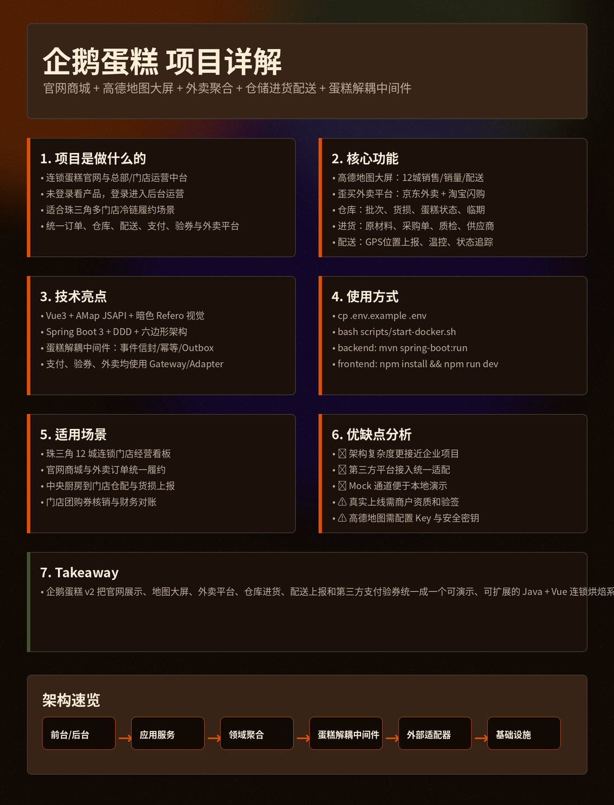
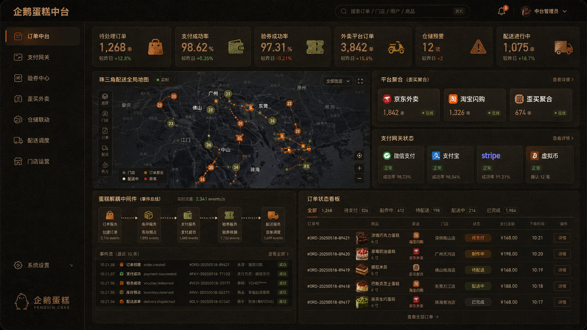
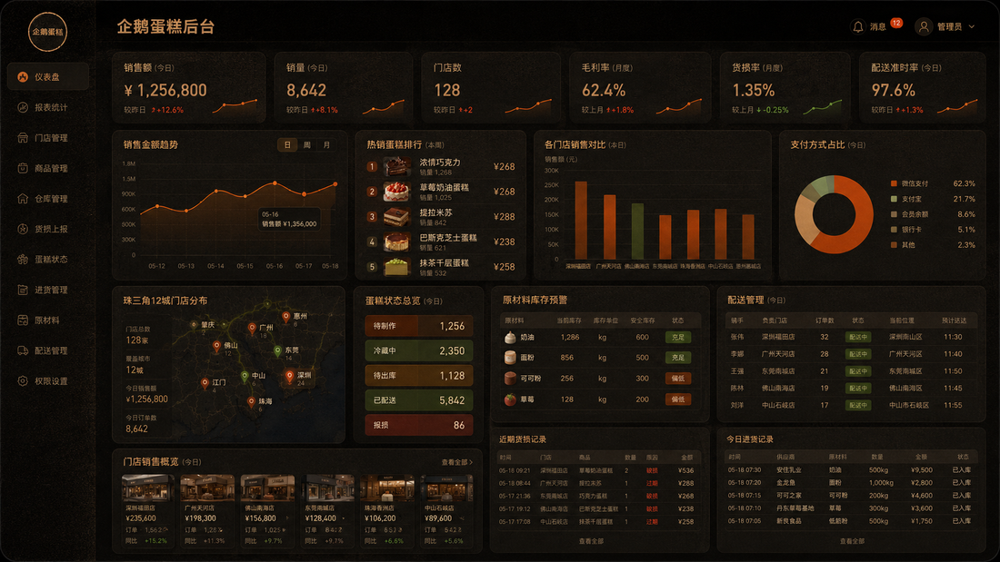

# 企鹅蛋糕 Penguin Cake v3 · ORYZO 三端优化版

> 面向连锁烘焙品牌的 **前台官网商城 + 中台运营编排 + 后台经营管理** 一体化项目。新版彻底摈弃马卡龙浅色风格，采用真实蛋糕摄影、深色软木质感、锈橙色操作焦点和高密度经营数据界面。



## 1. 本次优化重点

- **视觉重构**：参考 Refero ORYZO 风格，统一使用深色软木质感、暖色文字、锈橙色 CTA、12px 卡片、36px 胶囊按钮。
- **真实蛋糕内容**：替换为更逼真的巧克力、草莓奶油、提拉米苏、巴斯克芝士等蛋糕摄影风格内容。
- **三端产品架构**：从单后台升级为 `前台 / 中台 / 后台` 三端分工。
- **中台增强**：订单中台、支付网关、验券中心、歪买外卖、蛋糕解耦中间件、配送调度统一编排。
- **后台增强**：经营报表、珠三角 12 城地图、门店销售、仓库货损、蛋糕状态、原材料库存、进货与配送管理。

## 2. 设计稿预览

| 前台官网 | 中台运营 | 后台管理 |
|---|---|---|
|  |  |  |

## 3. 三端定位

### 前台 Frontstage

面向普通消费者，未登录也可以访问。

- 官网首页
- 真实蛋糕产品展示
- 蛋糕商城 / 定制蛋糕
- 门店配送说明
- 订单状态查询
- 登录入口

访问：`http://localhost:5173/`

### 中台 Middle Platform

面向运营、门店、客服、履约团队，负责系统之间的协作与流转。

- 订单中台
- 支付网关：微信支付 / 支付宝 / Stripe / 虚拟币
- 验券中心：美团 / 口碑 / 抖音
- 外卖平台：京东外卖 / 淘宝闪购 / 歪买聚合
- 蛋糕解耦中间件：事件总线、幂等、Outbox、事件日志
- 配送调度：骑手、位置、冷链温控

访问：`http://localhost:5173/middle`

### 后台 Backstage

面向总部管理层、财务、仓储、采购与门店管理员。

- 经营仪表盘
- 销售金额趋势
- 热销蛋糕排行
- 各门店销售对比
- 支付方式占比
- 珠三角 12 城门店地图
- 仓库管理、货损上报、蛋糕状态
- 进货管理、原材料库存预警
- 配送管理、骑手定位、准时率统计

访问：`http://localhost:5173/back`

## 4. 核心架构

```text
消费者 / 门店 / 平台订单
        │
        ▼
前台 Frontstage：官网展示、下单、订单状态
        │
        ▼
中台 Middle Platform：订单编排、支付网关、验券中心、外卖聚合、事件解耦
        │
        ▼
后台 Backstage：经营报表、仓储、进货、货损、配送、门店管理
        │
        ▼
基础设施：MySQL / Redis / RabbitMQ / MinIO / Nginx / Docker
```

## 5. 技术栈

### 前端

```text
Vue 3 + TypeScript + Vite + Naive UI + UnoCSS + Pinia + Vue Router
AMap JSAPI Loader + ECharts + Axios
```

### 后端

```text
Spring Boot 3 + Java 17 + MyBatis-Plus + MySQL + Redis + RabbitMQ + MinIO
DDD + 六边形架构 + Adapter/Gateway + Outbox + 事件解耦中间件
```

## 6. 目录结构

```text
penguin-cake-oryzo/
├─ frontend/                 Vue3 前台 / 中台 / 后台
│  └─ src/views/
│     ├─ PublicHome.vue      前台官网
│     ├─ MiddleLayout.vue    中台布局
│     ├─ MiddleDashboard.vue 中台运营看板
│     ├─ BackendLayout.vue   后台布局
│     └─ BackendDashboard.vue后台经营仪表盘
├─ backend/                  Spring Boot 后端
│  └─ src/main/java/com/penguin/cake/
│     ├─ domain/             领域模型与事件
│     ├─ application/        应用服务
│     ├─ infrastructure/     消息、地图、平台适配
│     ├─ middleware/         蛋糕解耦中间件
│     ├─ payment/            支付网关
│     ├─ voucher/            验券适配器
│     ├─ waimai/             歪买外卖聚合平台
│     ├─ warehouse/          仓库管理
│     ├─ procurement/        进货管理
│     └─ delivery/           配送管理
├─ sql/init.sql              初始化 SQL
├─ docs/ARCHITECTURE.md      架构说明
├─ docs/API-INTEGRATION.md   第三方接入说明
├─ docker-compose.yml
└─ scripts/
```

## 7. 启动方式

### 1）启动基础设施

```bash
cp .env.example .env
bash scripts/start-docker.sh
```

### 2）启动后端

```bash
cd backend
mvn spring-boot:run
```

### 3）启动前端

```bash
cd frontend
npm install
npm run dev
```

访问：

```text
前台官网：http://localhost:5173/
登录页：http://localhost:5173/login
中台运营：http://localhost:5173/middle
后台管理：http://localhost:5173/back
兼容旧后台：http://localhost:5173/admin  会重定向到 /back
后端接口：http://localhost:8080/swagger-ui.html
```

## 8. 高德地图配置

生产环境请在 `.env` 或前端环境变量中配置：

```env
VITE_AMAP_KEY=你的高德Web端Key
VITE_AMAP_SECURITY_JS_CODE=你的高德安全密钥
```

未配置时，地图大屏会自动显示离线模拟版，方便本地演示。

## 9. 外卖平台说明

“歪买”是本项目内部的外卖聚合平台，统一封装京东外卖和淘宝闪购：

```text
官网/中台 → 歪买外卖聚合层 → 京东外卖 Adapter
                         └──→ 淘宝闪购 Adapter
                         └──→ Mock Adapter
```

## 10. 重要说明

真实支付、验券、京东外卖、淘宝闪购与高德地图均需要平台资质、商户密钥、证书和回调验签。项目已生成接口层、适配器层和 Mock 通道，便于本地演示和后续替换真实 SDK。
