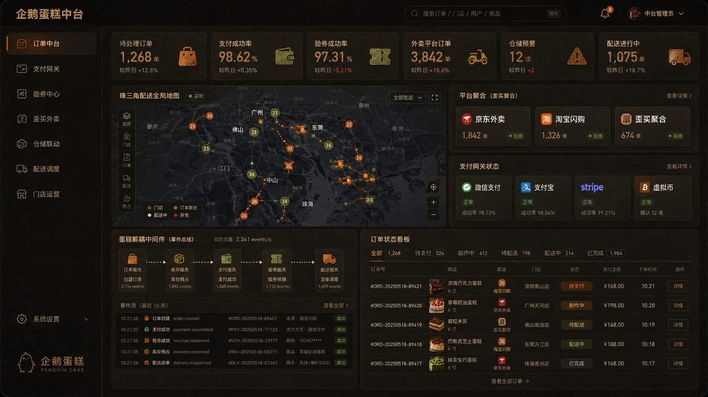

# 企鹅蛋糕 Penguin Cake · V5 严格还原版

企鹅蛋糕是一个基于 **Vue 3 + TypeScript + Spring Boot 3** 的真实蛋糕品牌三端系统。V5 版本严格按照三张设计图重新打磨为 **前台官网 / 中台运营中心 / 后台管理驾驶舱**，视觉参考 ORYZO 深色软木质感设计系统，采用真实蛋糕摄影、高级暗色界面、锈橙色交互焦点和高密度经营看板。

## 三端预览

### 1. 官网前台 `/`

- 未登录即可浏览产品展示
- 蛋糕类别点击生效：全部蛋糕 / 巧克力 / 芝士 / 水果 / 慕斯
- 点击加入购物车后进入购物车链路
- 必须填写收货人、手机号、城市、详细地址、送达时间后，才能进入支付页
- 页面结构严格对齐设计图：顶部导航、左侧 01/02/03/04 序号、Hero 真实蛋糕、横向商品卡、时令限定、门店体验、配送服务、右侧悬浮工具栏、Footer


### 2. 中台运营中心 `/middle`

- 今日订单概览
- 渠道订单流转
- 外卖平台聚合：京东外卖 / 淘宝闪购 / 外卖聚合
- 支付网关状态：微信支付 / 支付宝 / Stripe / 虚拟币支付
- 验券中心：美团券 / 口碑券 / 抖音券
- 库存预警、商品中心、配送调度、服务健康状态
- 页面结构严格按中台图重排，重点突出运营编排与状态监控



### 3. 后台管理驾驶舱 `/back`

- 销售额、订单量、客单价、新增会员、配送中订单、骑手在线
- 门店表现、珠三角门店与配送地图、仓库状态、货损上报、采购进货、冷链温度、员工在线
- 销售金额趋势、畅销蛋糕 TOP5、支付渠道占比、城市销售额排名、订单来源占比
- 仓库管理、货损记录、蛋糕状态、原材料预警、采购单、配送任务
- 页面结构严格按后台管理驾驶舱图重排，形成高密度经营大屏


## 核心技术栈

```text
前端：Vue 3 + TypeScript + Vite + Pinia + Vue Router + Naive UI
后端：Spring Boot 3 + Spring Security + MyBatis-Plus 风格接口分层
数据库：MySQL
缓存：Redis
地图：高德地图配置预留，页面内置离线珠三角可视化 Mock
部署：Docker Compose + Nginx + Spring Boot Jar
```

## 业务模块

```text
官网前台：真实蛋糕展示、分类筛选、加入购物车、订单状态入口
购物车：数量增减、删除、收货人、手机号、地址、送达时间、备注
支付：微信支付、支付宝、Stripe、虚拟币支付、Mock 支付适配器
验券：美团、口碑、抖音验券与核销接口
外卖：京东外卖、淘宝闪购、外卖聚合适配器
中间件：蛋糕解耦中间件 / 事件总线
仓储：库存预警、蛋糕状态、货损上报、冷链温度
进货：供应商、采购单、原材料库存与预警
配送：骑手任务、位置上报、配送状态、冷链监控
报表：销售额、销量、门店、城市、支付方式、订单来源
```

## 启动方式

### 前端

```bash
cd frontend
npm install
npm run dev
```

访问：

```text
官网前台：http://localhost:5173/
中台运营：http://localhost:5173/middle
后台管理：http://localhost:5173/back
购物车：http://localhost:5173/cart
支付页：http://localhost:5173/checkout
```

### 后端

```bash
cd backend
mvn spring-boot:run
```

### Docker Compose

```bash
docker compose up -d --build
```

## V5 重点修复

```text
1. 严格按照三张设计图重排：首页、中台、后台
2. 统一外卖命名为外卖平台 / 外卖聚合 / Takeout
3. 补齐中台底部栏目：库存预警、商品中心、配送调度、服务健康状态
4. 补齐后台栏目：门店表现、仓库状态、货损、原材料、采购、配送任务
5. 增加购物车完整链路：加入购物车 → 地址与个人信息 → 支付页面
6. 修复蛋糕类别点击不生效问题
7. 整理 TypeScript 导出、路由和主要页面格式
```

## 第三方平台说明

真实对接微信、支付宝、Stripe、虚拟币支付、美团验券、口碑验券、抖音验券、京东外卖、淘宝闪购与高德地图时，需要在 `.env` / `application.yml` 中配置对应商户号、密钥、证书和回调地址。当前项目默认保留 Mock + Adapter 结构，方便本地演示和二次扩展。
